<h1 align="center">DanjelPiDev</h1>

---

### About Me
I develop full-stack systems by day and build strange, experimental AI projects by night.

This GitHub is where I explore everything from emotion-aware spiking neural networks and auto-updating LLMs, to low-level backup bots and Unreal Engine prototypes. Some of it works. Some of it breaks beautifully.
Most of what you see here wasn't made for show, it was built to learn something new or prove that it could be done. Sometimes both.

If you're here to find polished SaaS clones, you're in the wrong repo.

If you're into complex systems, weird architecture, and slightly unhinged passion projects... Welcome.

  

---

  

  
Plain-text Version, If the bot fails to read the svg above

If you're only here to farm followers, congratulations... you've already failed the Turing Test.  
I don't follow people back just because they clicked a button. I follow projects, ideas, and sometimes my own curiosity.  
Also, my follow policy is strict: I only follow my nose... and that's when it smells like good food.  
*q.e.d.*

---

### Tech Stack & Tools
#### Languages & Frameworks

- Python, Java, TypeScript, C++, C#
- PyTorch, Spring Boot, React, Unreal Engine, Unity

#### Focus Areas

- Machine Learning (SNNs, Transformers, RL, CNNs)
- Full-Stack Web Systems (APIs, Admin UIs, Video platforms)
- Tooling & Automation (backup systems, DB scripting)

  

---

### GitHub Stats

  
  

---

### Contact

    

---

**I'm always interested in connecting with fellow developers and exploring new project ideas. Feel free to reach out or explore my projects!**

